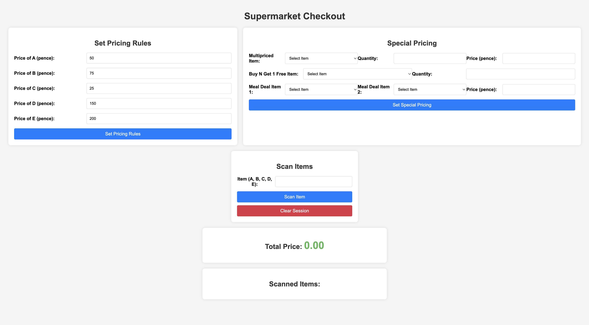

# Super Market Checkout System

## Project Definition

The **Super Market Checkout System** is designed to optimize the checkout process in a supermarket setting. This system ensures efficient pricing, accommodates special pricing rules, and manages scanned items effectively. It also provides a comprehensive overview of the total price and a detailed list of scanned items. The core functionality of the project is divided into three main sections, supplemented by auxiliary sections, as outlined in the project assessment document.

### Main Sections

1. **Set Pricing Rule**
   - This section empowers users to define and configure pricing rules for various products, allowing them to set standard prices and specify the conditions under which these prices apply. This foundational capability ensures that every product has a clearly defined price, which is crucial for the checkout process. If a user does not set a specific price, the default price from the assessment document will be applied. Additionally, if the price list is updated after an item has been scanned, the scanned item will be removed from the list to maintain accuracy and consistency.
  
    ***Default price & discount conditon***

    

2. **Special Pricing**
   - In this section, users can establish special pricing rules and discounts, including bulk discounts and promotional offers. This feature provides flexibility in pricing strategies, enabling customized promotions to attract more customers and boost sales. If users do not set a special price, the default discount setting will apply. Additionally, if the pricing is updated after an item has been scanned, the scanned item will be removed from the list to ensure accuracy.

3. **Scanned Items**
   - This section handles the scanning of items during the checkout process. Each scanned item is processed according to the predefined pricing rules and any applicable special pricing. This section ensures accurate and efficient item scanning, contributing to a smooth checkout experience.

### Auxiliary Sections

1. **Total Price**
   - The total price section calculates the cumulative cost of all scanned items, factoring in any special pricing rules or discounts. This section provides a real-time total that updates as items are scanned.
2. **List of Scanned Items**
   - This section displays a detailed list of all scanned items, including the number of items scanned.

### Detailed Functionality

- **Standard Pricing:** Define base prices for individual products.
- **Conditional Pricing:** Set conditions under which certain prices apply (e.g., buy-one-get-one-free, discounts on certain quantities of items).


### How to Use and System Behavior

#### 1. Set Pricing Rule

-  Navigate to the "Set Pricing Rule" section to add or modify pricing. Select the type of product from A, B, C, D, or E.

#### 2. Setting Special Pricing

- Go to the "Special Pricing" section to create or update special pricing rules. This app contains only three discount types as per the assessment document, but this section allows users to alter the discount policy based on the type of product, its respective price, and the number of units.
  
#### 3. Behavior
 When the prices are set, they are stored in session variables since no database is being used. If the user needs to test new prices or discount evaluations, they can click the ***Clear Session*** button located below the ***Scan Item button***. This action will reset all data and settings to their default values.

### Technologies Used

- **Frontend:** HTML, CSS,
- **Backend:** PHP,
- **VersionControl:** github

### Project Structure
```
├── Checkout.php
├── img
       ├──defaulConditon.png
├── index.php
├── form.html
├── styles.css
└── README.md
```

## Run Project
#### To test the project, you can go to this link [Super Market Checkout](http://34.227.227.10/) and test the given conditions in the project assigned.

## OR to run local machine 

### Setup
#### Prerequisites
 To run the project in your local system you need to have the following:

- PHP installed on your server (version 7.0 or higher recommended)
- A web server (e.g., Apache, Nginx)
#### Installation

To install and run the project locally, place the files in ***/var/www/html/*** for macOS and Linux, or in ***'C:\xampp\htdocs***' for Windows. Then, configure the necessary settings in the configuration files. 


1. **Clone the Repository**
- clone the repository and place it in your server file like htaccess or http
  ```sh
    git clone https://github.com/Vibepasson123/checkout.git

    cd checkout

   ```

## Future works / Improvements.
  There are several points we intended to work on, but due to limitations and lack of time, we could not achieve them. These include:
- **Realistic UI:** Develop a more realistic and user-friendly interface to enhance the overall user experience.
- **Controlled Price:** Users can scan items and update the price in the middle without losing the scanned list.

- **Improved Function:** Add more functionality such that discounts can be based on item stock quantity and multiple discounts based on date, time, and special coupons.


## App outlook
 